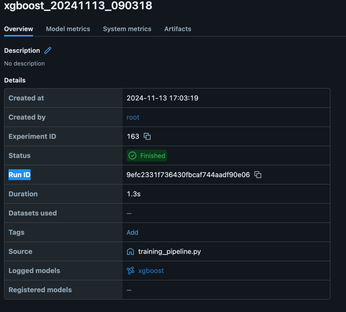

# Customer Churn Prediction Project

## Overview

This project implements a machine learning pipeline for predicting customer churn. The pipeline includes data
processing, model training, experiment tracking, inference, and monitoring capabilities.

## Project Structure

```
├── src/
│   ├── data/        # Data loading and preprocessing
│   ├── model/       # Model training and evaluation
│   ├── monitoring/  # Model monitoring and reporting
│   ├── pipelines/   # Main pipeline scripts with the config file
│   └── utils/       # Helper utilities
├── infra/          # Settings enables local testing using docker compose
├── tests/          # Unit tests
├── notebooks/      # Jupyter notebooks for exploration
├── .github/workflows/  # GitHub Actions workflows
└── docker/         # Dockerfile and compose files
```

## Environment Setup

### Prerequisites

- Docker https://docs.docker.com/desktop/setup/install/mac-install/
- Python 3.10 or virtual environments https://www.freecodecamp.org/news/how-to-setup-virtual-environments-in-python/

### Clone the repository

```bash
git clone https://github.com/gigifokchiman/churn-model-interview-gigi.git
cd churn-model-interview-gigi
```

### Spin up infrastructure

To set up MLflow and MinIO (local testing of AWS S3)

```bash
cd infra
docker compose -f docker-compose.yml up -d
```

## Core pipelines

The core pipeline logic can be found under `src/pipelines`.

### Build the Docker image

```bash
docker build -t churn-model-train -f Dockerfile.train .
docker build -t churn-model-inference -f Dockerfile.inference .
```

### Data generation

- To generate the sample data to MinIO:

```bash
docker run --network host churn-model-train python -m src.pipelines.data_pipeline
```

The data generation part here is to mock an aggregated dataset, where the source data can come from a data warehouse.
Using the default config, one training and one inferencing dataset are stored in MinIO (bucket: data-staging)
as csvs for human-readability and easy handling.

### Model training

- To run the training pipeline:

```bash
docker run --network host churn-model-train
```

Data scientists can play around the src/pipelines/config.yaml to change how they want to train the model.

The output of the models include

- Artifacts, metrics, parameters are tracked by mlflow from the link: http://localhost:15000/
- The artifacts are stored in MinIO (bucket: mlflow_artifacts)

Automating the training pipeline upon model or training data changes can be done in these ways:

- Triggers
    - Data change triggers can be sourced from S3 events to trigger to run dockerfile.train when there is a new dataset
      file is added to the bucket / prefix.
    - Code change triggers can be done by CI/CD work to detect changes to the src folder in dev branch.
- Container registries
    - ECR is a good choice to store the docker images.
- Compute
    - The compute source can be ECS or other container based solution to run the dockers.
    - If ECS is used, the trigger initiates a new task from the latest task definition under a train service
      pre-configured int the ECS.
- Notification can be added as well, e.g. SNS, for alerts. 

### Inferencing

To run the inference pipeline:

```bash
docker run --network host \
  --env-file src/pipelines/.env.test \
  -e ARTIFACTS_DIR="163/9efc2331f736430fbcaf744aadf90e06/artifacts" \
  churn-model-inference
```

`ARTIFACTS_DIR` is the directory where the model artifacts are stored in MinIO with the format {Experiment ID}/{Run
ID}/artifacts
You can copy the id from the mlflow ui: http://localhost:15000/ and pick the best run.


The pipeline generates the result csv and a health metrics report stored into bucket ml-result in MinIO.

Automating the inferencing pipeline is similar to how we automate the training pipeline.

For baked-in artifacts, include model files directly in the Docker image during build time which ensures self-contained
deployments but requires rebuilding images for whatever updates.
For separate storage, keep model artifacts in S3/MinIO/storage and download them at runtime which allows flexible model
updates without rebuilds but requires additional infrastructure and handling of external dependencies.

## Additional notes

### About XGBoost

If you encounter `libomp` related errors, refer the installation script at `scripts/setup/setup_mac.sh`. Mac do not
support GPU-accelerated XGBoost, we should use the CPU version instead.

### Scaling

- Distributed computation can be considered with additional work, e.g. use spark-based compute for data pipelines. 
- The dataset needs to be distributed across machines. The machines can be scaled out to provide more computation. 

### Mini-batch inferencing / close to real-time inferencing
- The scoring methods should be improved to handle small batches efficiently. 
- The health metrics may be separated out from the inferencing as the scoring and monitoring now may have different lifecycles.
  - Availability of the "ground truth" in production or delayed responses.

## Appendix

### 1. Assumptions

- As the pipelines were built from scratch for this assignment, it may not fully reflect production-level best
  practices.
- All tests are run locally instead of on AWS to avoid unnecessary costs on cloud.

### 2. Branches

- Setting up branches, including `dev`, `main` and `features/**`.

### 3. Initial deliverables from the data scientists.

- Their scripts were located in the folder `notebooks` and were pushed to the `features/mlops-xgboost` branch.
- The MLOps engineer can get the files from the `dev` branch with a push requests.

### 4. Code refactoring

- Refactoring can have various level of maturity. For this exercise, we aim to separate the training and inferencing
  pipeline only.
- Minimal requirements for inferencing pipeline
    - The training part is removed.
    - The metrics part is tricky - it depends if the "ground truth" is available in production when the batch job 1
    - The data transformation parameters should be stored and used for data to be used in inferencing instead of
      deriving from the data. The parameters should be updated in retraining.
- Suggestion to the original training script: it is better to derive the median for data imputation from the TRAINING
  data only.

### 5. Set a docker compose for local testing

- Simple script for local testing in the folder `infra/docker-compose-postgres.yml`

### 6. MLOps - local development

- The python version was not provided. This seems to be python3.10 but it can be communicated with users in reality.
- As I was using macbook for local development and xgboost cannot support GPU in macOS, I have developed 2 requirement
  files
    - requirements-train.txt for non-GPU setting and
    - requirements-train-gpu.txt for GPU setting.
    - reference: https://xgboost.readthedocs.io/en/latest/install.html
- I used both ```pip install``` and ```brew``` for the settings. For reference only, you may run
    - ```bash scripts/setup/setup_mac.sh```
- The code can be run smoothly under the newly created virtual environment. ```python notebooks/xgboost.py```
- I ran the script twice with the same result. Likely that the randomness can be controlled properly.
- In reality, some sample result can be used to verify via mlflow tracking or manual sharing from data scientist.

```text
ic| train_metrics: {'Accuracy': 0.8612857142857143,
                    'F1 Score': 0.8615165200855717,
                    'Precision': 0.86188528488538,
                    'ROC AUC Score': 0.861286003287307,
                    'Recall': 0.8611480707089907}
ic| test_metrics: {'Accuracy': 0.49566666666666664,
                   'F1 Score': 0.5014827018121911,
                   'Precision': 0.4922380336351876,
                   'ROC AUC Score': 0.4957788841088787,
                   'Recall': 0.5110812625923439}
```
